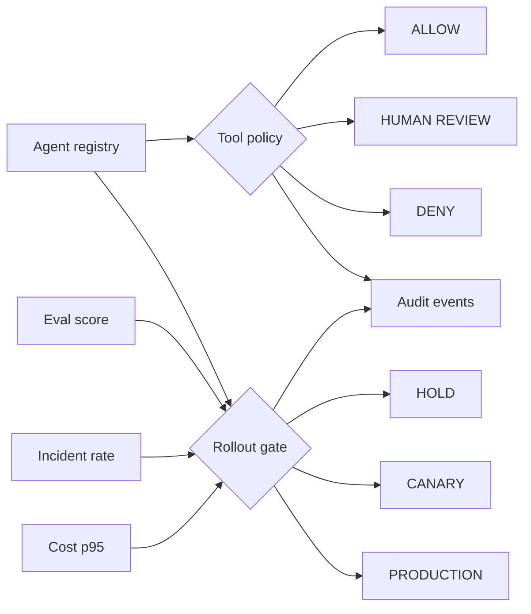

# Agent Control Plane

**CONTROL flagship in the [Ash Intelligence Lab](https://github.com/AshIntelligence/agenticmine)**

**[▶ Try the Control Plane live](https://ash-intelligence-lab.streamlit.app/?product=agentic-product-control-plane)** · **[Open the full lab](https://ash-intelligence-lab.streamlit.app/)**

`Python · AI platform · policy controls · rollout governance`

This project puts the controls around an agent in one place: **registration, tool permissions, approval boundaries, eval gates, cost budgets, incident thresholds, rollout state and audit events**.

It separates three decisions that often get blurred together:

1. Is the agent registered with the right contract?
2. Is this tool call allowed, denied, or waiting for human approval?
3. Do current quality, reliability and cost signals support the next rollout stage?

## Core objects

`AgentSpec` defines registered tools, approval-required tools, rollout stage and quality/cost thresholds.

`authorize_tool(...)` returns **ALLOW / REVIEW / DENY**.

`assess_rollout(...)` evaluates quality, incident and cost gates separately from tool authorization and returns **HOLD / CANARY / PRODUCTION** with blockers and a next action.

`ControlPlane` keeps an in-memory registry and audit trail so the reason behind a decision is available after the fact.

## Architecture



## Run

```bash
python main.py
python main.py --test
python -m unittest discover -s tests -v
```

No external services or API keys are required.

## Next

Durable execution state, versioned policy, rolling per-agent budgets and an approval UI that records reviewer decisions in the audit trail.
