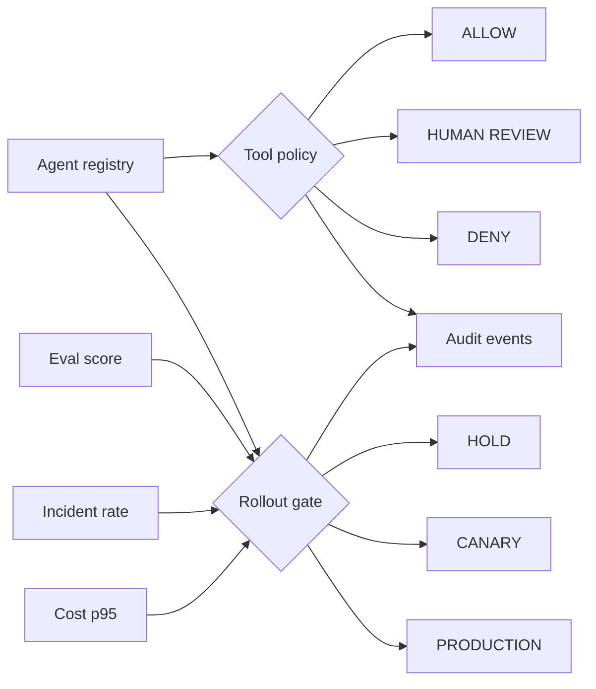

# Agent Control Plane

[](https://github.com/AshIntelligence/agent-control-plane/actions/workflows/tests.yml)

`Python · AI platform · policy controls · rollout governance`

This project puts the operating controls around an agent in one inspectable place: **registry, tool permissions, approval boundaries, evaluation gates, cost budgets, incident thresholds, rollout state and audit events**.

I use it to keep three decisions separate:

1. Is the agent registered with the right contract?
2. Is this tool call allowed, denied, or waiting for human approval?
3. Do current quality, reliability and cost signals allow the rollout to advance?

## What the code models

`AgentSpec` defines registered tools, approval-required tools, rollout stage and quality/cost thresholds.

`authorize_tool(...)` returns **ALLOW / REVIEW / DENY**.

`assess_rollout(...)` evaluates quality, incident and cost gates separately from tool authorization and returns **HOLD / CANARY / PRODUCTION** with blockers and a next action.

`ControlPlane` keeps an in-memory registry and audit trail so a decision can be inspected after the fact.

## Architecture



## Run

```bash
python main.py
python main.py --test
python -m unittest discover -s tests -v
```

No external services or API keys are required.

## Next

The next iteration is durable execution state, versioned policy, rolling per-agent budgets and an approval UI that records reviewer decisions in the audit trail.

This is one flagship from the broader [Ash Intelligence systems lab](https://github.com/AshIntelligence/agenticmine).