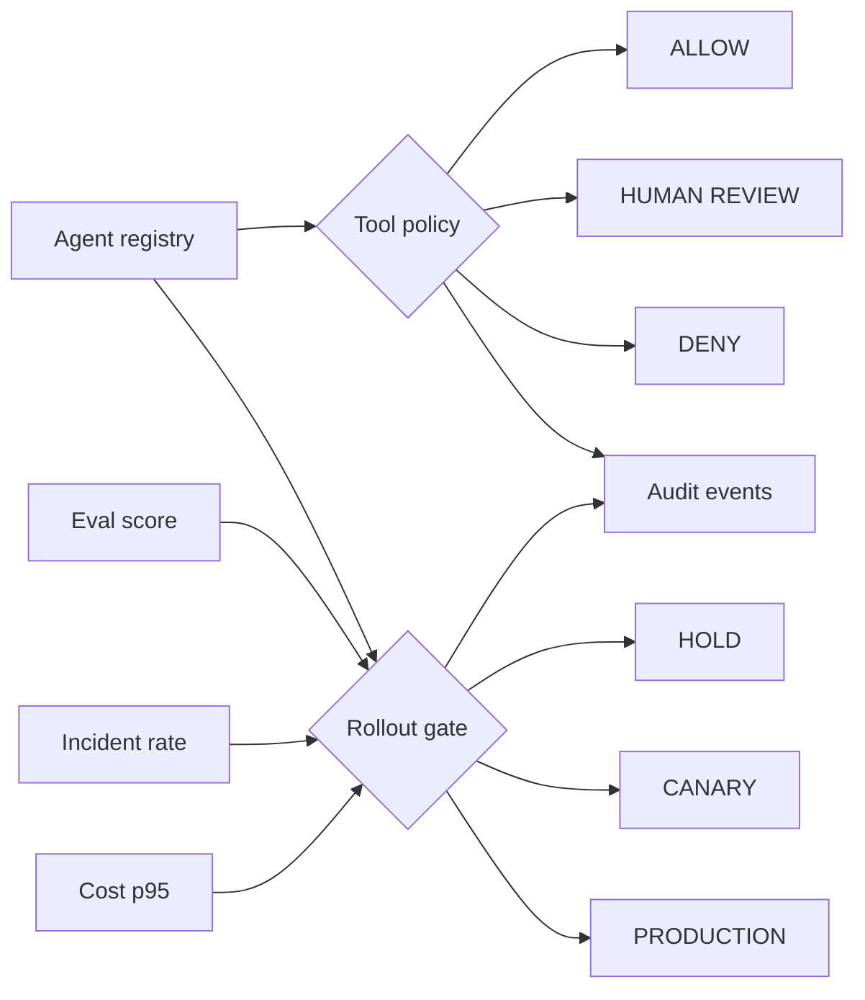

# Agent Control Plane

**CONTROL · Agent operating boundaries**

### Product question
**When is an agent actually allowed to act?**

**[▶ Try the Control Plane live](https://ash-intelligence-lab.streamlit.app/?product=agentic-product-control-plane)** · **[Explore the full systems lab](https://ash-intelligence-lab.streamlit.app/)**

`Python · AI platform · policy controls · rollout governance`

Agent Control Plane is the **CONTROL** flagship in Ash Intelligence. It puts the operating boundaries around an agent in one inspectable place: **registry, tool permissions, approval boundaries, evaluation gates, cost budgets, incident thresholds, rollout state and audit events**.

The project deliberately keeps three decisions separate:

1. Is the agent registered with the right contract?
2. Is this tool call **allowed, denied or waiting for human approval**?
3. Do current quality, reliability and cost signals allow rollout to advance?

That separation matters because an agent can be healthy enough for canary traffic while still being unauthorized to perform a particular high-consequence action.

## What the code models

`AgentSpec` defines registered tools, approval-required tools, rollout stage and quality/cost thresholds.

`authorize_tool(...)` returns **ALLOW / REVIEW / DENY**.

`assess_rollout(...)` evaluates quality, incident and cost gates separately from tool authorization and returns **HOLD / CANARY / PRODUCTION** with blockers and a next action.

`ControlPlane` keeps an in-memory registry and audit trail so the decision can be inspected after the fact.

## Architecture



## Product principle

**Agency is not a blanket capability. It is a set of explicit permissions, states and operating thresholds.**

The prototype makes those boundaries visible so “the model can do it” never silently becomes “the product should allow it.”

## Run

```bash
python main.py
python main.py --test
python -m unittest discover -s tests -v
```

No external services or API keys are required.

## Next

The next iteration is durable execution state, versioned policy, rolling per-agent budgets and an approval UI that records reviewer decisions in the audit trail.

Part of **CONTROL** in the broader [Ash Intelligence Lab](https://github.com/AshIntelligence/agenticmine).
